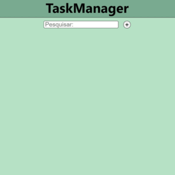

# Task-Manager

• [Introdução](#introdução)  
• [Funcionalidades](#funcionalidades)  
• [Tecnologias](#tecnologias)  
• [Instalação](#instalação)  
• [Licença](#licença)  

## Introdução

***Task-Manager*** é um aplicativo para gerenciar tarefas de forma mais prática. Você pode criar tarefas e organizar suas sub-tarefas, facilitando o acompanhamento do progresso. Além disso, é possivel pesquisar as tarefas e removê-las com facilidade.<br/>ㅤ<br/>


## Funcionalidades

**Criação de Tarefas** ✅: Permite a criação de novas tarefas e a organização de sub-tarefas de maneira prática.

**Deleção de Tarefas** ❌: Tarefas podem ser deletadas clicando duas vezes no botão "X".

**Subtasks com Cores** 🎨: As subtarefas podem ser destacadas com três cores: verde, amarelo e vermelho.

**Pesquisa de Tarefas** 🔍: Oferece a funcionalidade de pesquisar tarefas e subtarefas pelo nome.

**Armazenamento Local** 💾: As tarefas são salvas automaticamente no localStorage.


## Tecnologias

 Usado para construir a interface do aplicativo e gerenciar o estado das tarefas, permitindo a criação de componentes reutilizáveis.

 Utilizado para adicionar tipagem ao JavaScript, proporcionando maior segurança e robustez ao código.

 Utilizado para aplicar estilos diretamente aos componentes, permitindo uma abordagem modular e dinâmica na estilização.

 Usado para estilizar o aplicativo, proporcionando um visual melhor e responsivo.

 Utilizado para gerenciar a navegação entre diferentes páginas do aplicativo.


## Instalação

### • Pré-requisitos
Tenha o [Node.js](https://nodejs.org/en/download/package-manager)🛠️ instalado em sua máquina para poder executar o aplicativo.

### • Passos para instalação

• Clone o repositório:

```sh
git clone https://github.com/LucasMartins717/taskmanager-ts
```

• Acesse o diretório do projeto:

```sh
cd taskmanager-ts
```

• Instale as dependências:

```sh
npm install
```

• Inicie o aplicativo:

```sh
npm run dev
```

• Dê uma olhada na porta gerada no terminal. Você pode clicar no link segurando Ctrl ou simplesmente digitar o endereço no navegador para abrir o aplicativo.


## Licença

• Este projeto utiliza a Licença MIT. Para mais informações, consulte o arquivo [LICENSE](./LICENSE).
